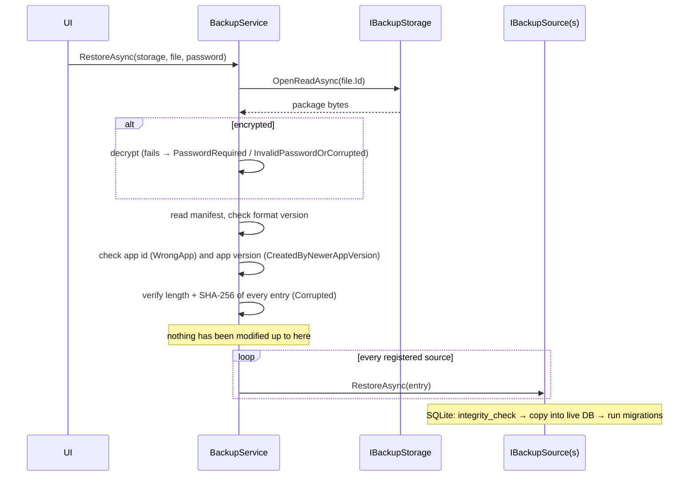

# Data and backup

Apps are **local-first**: all data is stored in a SQLite database on the device and the app works without network.
To make sure data is never lost, the app backs it up to cloud storage **owned by the user** (Google Drive or
OneDrive), optionally encrypted with a password only the user knows.

## Local database

| Topic | Rule |
|---|---|
| Engine | SQLite (Microsoft.Data.Sqlite) with EF Core 10 |
| Location | `FileSystem.AppDataDirectory/<app>.db` (private app storage) |
| Base class | `LocalDbContext` (Vafadar.Data) |
| Registration | `services.AddLocalDatabase<TContext>(path)` registers `IDbContextFactory<TContext>`, the auditing interceptor and the database as a backup source |
| Context lifetime | Short-lived contexts from `IDbContextFactory` (`await using var db = await factory.CreateDbContextAsync()`); there are no request scopes in a mobile app |
| Schema changes | Always through EF Core migrations; applied at startup by `DatabaseInitializer` (`MigrateLocalDatabase<TContext>()`) |
| Identifiers | `Guid` version 7 (`Entity` base class): time-ordered, and unique across devices and restores – ready for sync |
| Audit fields | Entities implementing `IAuditableEntity` get `CreatedAt` / `UpdatedAt` (UTC) automatically |
| Moments in time | `DateTimeOffset`, stored as UTC ticks (`UtcTicksDateTimeOffsetConverter`) so SQL can filter and sort them |
| Calendar dates | `DateOnly` (stored as `yyyy-MM-dd` text, sortable) |
| Money | **`long` in minor units** (e.g. cents) plus a currency code. SQLite has no decimal type; EF stores `decimal` as text and cannot sum or compare it in SQL |
| Enums | Stored as integers; never renumber released values |

### Migrations

```powershell
# Add a migration (run from the repository root)
dotnet tool restore
dotnet ef migrations add <Name> --project src/Apps/Finance/Vafadar.Finance.Data

# Inspect the SQL a migration produces
dotnet ef migrations script --project src/Apps/Finance/Vafadar.Finance.Data
```

The `*.Data` projects contain an `IDesignTimeDbContextFactory`, so the EF tools do not need to start the MAUI app.
Migrations must be backward compatible with existing user data: add columns with defaults, migrate data in the
migration, never drop user data silently.

## Backup design

### What a backup is

A backup is a single file, `pro.vafadar.zanance_20260925T143000Z.vbak`:

```text
┌────────────────────────── .vbak ───────────────────────────┐
│ optional encryption envelope (AES-256-GCM)                  │
│ ┌──────────────────── ZIP package ────────────────────────┐ │
│ │ manifest.json    format version, app id, app version,   │ │
│ │                  created at, device, entries + SHA-256  │ │
│ │ data/database.sqlite   consistent SQLite snapshot       │ │
│ │ data/<other source>    e.g. attachments (future)        │ │
│ └─────────────────────────────────────────────────────────┘ │
└─────────────────────────────────────────────────────────────┘
```

* **Sources** (`IBackupSource`) provide the content. `SqliteDatabaseBackupSource` uses SQLite's online backup API,
  which produces a consistent snapshot even while the app is writing (copying the file directly could capture a
  half-written state).
* **Storages** (`IBackupStorage`) only move files: `LocalFolderBackupStorage`, `GoogleDriveBackupStorage`,
  `OneDriveBackupStorage`. Adding another provider (e.g. Dropbox) means implementing four methods.
* **`BackupService`** orchestrates: create package → encrypt (optional) → upload → apply retention (keep the newest
  10 by default). Only one backup or restore runs at a time.

### Encryption

| Property | Value |
|---|---|
| Cipher | AES-256-GCM (authenticated: any modification is detected) |
| Key derivation | PBKDF2-HMAC-SHA256, 600,000 iterations, random 16-byte salt per backup |
| Header | `VBE1` · iterations · salt · nonce · tag, authenticated as associated data |
| Password normalization | Unicode NFC; Arabic Yeh/Kaf → Persian; Persian/Arabic-Indic digits → ASCII (the same password typed on different Persian keyboards works) |
| Password storage | **None.** A forgotten password cannot be recovered – the UI must say so clearly |

### Restore



* Everything is validated **before** any existing data is touched.
* A backup from an **older** app version is restored and then migrated to the current schema.
* A backup from a **newer** app version is refused ("update the app first"), because an older schema could lose data.
* Backups restore across platforms (Android ↔ iOS ↔ Windows): the app id is configured explicitly
  (`FinanceApp.AppId`), not taken from the platform package name.

### Storage providers compared

| | Google Drive | OneDrive |
|---|---|---|
| Location | Hidden `appDataFolder` | Visible `Apps/<app name>` folder |
| Permission (scope) | `drive.appdata` – only the app's own folder | `Files.ReadWrite.AppFolder` – only the app's own folder |
| User can see files | No (only storage used, under Drive → Settings → Manage apps) | Yes, and can download/delete them |
| Shared between apps | Per Google Cloud project (file names carry the app id, so apps can share a project) | Per Entra app registration (same) |
| Upload | Resumable upload (no practical size limit) | Simple upload (up to 250 MB) |
| Account | Any Google account | Personal Microsoft account and work/school accounts |

Both are free for the user within their existing quota and cost the developer nothing.

### Scheduling

* **Manual**: "Back up now" and "Restore" in each app's backup settings.
* **Automatic** (planned in `Vafadar.Maui.Backup`): when the app starts or resumes and `IsAutomaticBackupDue()`
  (default: daily), a backup runs in the background to the storage the user configured. Later, Android WorkManager /
  iOS background tasks can run it while the app is closed.
* **Local export**: `CreatePackageAsync` produces the file so the user can share or save it anywhere (e-mail,
  USB, another cloud).

### Android system backup

Android's built-in Auto Backup (`android:allowBackup="true"`) additionally backs up app data to the user's Google
account and restores it on a new phone. It is kept enabled as an extra safety net; whether financial data should be
excluded from it (via data extraction rules) is decided per app before release and documented in the
[privacy matrix](../privacy/privacy-matrix.md).

### Limits and future work

* Packages are built in memory – fine for databases up to tens of megabytes. Streaming can be added if an app ever
  stores large media.
* Backup is not sync: restoring replaces the data on the device. Multi-device sync is discussed in
  [web-and-shared-data.md](web-and-shared-data.md).
