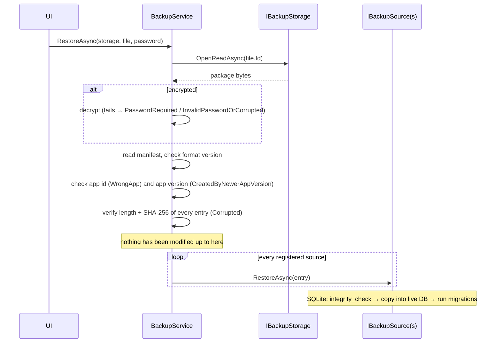

# Data and backup

Apps are **local-first**: all data is stored in a SQLite database on the device and the app works without network.
To make sure data is never lost, the app creates backup packages with optional password encryption that the
user keeps or shares. The libraries can also store them in cloud storage **owned by the user** (Google Drive or
OneDrive). In Zanance they are offered only in builds with configured OAuth clients, as an explicit choice of the
user, and local and cloud backups both offer optional password encryption (D-62 supersedes the mandatory cloud password in D-35).
The device remembers only the protection choice, defaulting to on; passwords are never saved. A password may be
reused, but encrypted backup creation requires entry and confirmation each time. Connected cloud account access
does not encrypt the portable file: anyone obtaining an unprotected package can read it.

First-run restore uses the same validation, preview, confirmation and safety-copy flow before any account is created.
Restored accounts complete onboarding without a duplicate account, preserving profile preferences. Empty backups
still need onboarding. Theme is device-wide and not restored from a package (D-62).

## Local database

| Topic | Rule |
|---|---|
| Engine | SQLite (Microsoft.Data.Sqlite) with EF Core 10 |
| Location | `FileSystem.AppDataDirectory/<app>.db` (private app storage) |
| Base class | `LocalDbContext` (Vafadar.Data) |
| Registration | `services.AddLocalDatabase<TContext>(path)` registers `IDbContextFactory<TContext>`, the auditing interceptor and the database as a backup source |
| Context lifetime | Short-lived contexts from `IDbContextFactory` (`await using var db = await factory.CreateDbContextAsync()`); there are no request scopes in a mobile app |
| Schema changes | Always through EF Core migrations; applied by `MigrateLocalDatabase<TContext>()` when the app creates its first window (`App.CreateWindow`), not while the app is built – Android builds it in `Application.onCreate`, also for a notification, with a time limit (D-46) |
| Identifiers | `Guid` version 7 (`Entity` base class): time-ordered, and unique across devices and restores – ready for sync |
| Audit fields | Entities implementing `IAuditableEntity` get `CreatedAt` / `UpdatedAt` (UTC) automatically |
| Moments in time | `DateTimeOffset`, stored as UTC ticks (`UtcTicksDateTimeOffsetConverter`) so SQL can filter and sort them |
| Calendar dates | `DateOnly` (stored as `yyyy-MM-dd` text, sortable) |
| Money | **`long` in minor units** (e.g. cents) plus a currency code. SQLite has no decimal type; EF stores `decimal` as text and cannot sum or compare it in SQL |
| Enums | Stored as integers; never renumber released values |

### Migrations

```powershell
# Add a migration (run from the repository root)
dotnet tool restore
dotnet ef migrations add <Name> --project src/Apps/Zanance/Vafadar.Zanance.Data

# Inspect the SQL a migration produces
dotnet ef migrations script --project src/Apps/Zanance/Vafadar.Zanance.Data

# After every model change: regenerate the compiled model the app loads at startup
dotnet ef dbcontext optimize --project src/Apps/Zanance/Vafadar.Zanance.Data `
    --startup-project src/Apps/Zanance/Vafadar.Zanance.Data `
    --output-dir CompiledModel --namespace Vafadar.Zanance.Data.CompiledModel
```

The `*.Data` projects contain an `IDesignTimeDbContextFactory`, so the EF tools do not need to start the MAUI app.

**Compiled model** (Zanance, D-44): building the EF model from `OnModelCreating` took about four seconds of every cold
start on an Android emulator. `Vafadar.Zanance.Data/CompiledModel` holds the generated model, which EF Core picks up
through its `DbContextModel` assembly attribute; the EF tools still build the model from code. A test
(`Compiled_model_matches_the_model_in_code`) fails when the compiled model is out of date. It is built on the calling
thread (`Microsoft.EntityFrameworkCore.Issue31751`): EF's default second thread hangs the app under Mono. At startup
`MigrateLocalDatabase` only runs `Migrate()` when the history lists a pending migration, because `Migrate()` also
compares the whole model with the migrations; the tests start from an empty database and keep that check.
Migrations must be backward compatible with existing user data: add columns with defaults, migrate data in the
migration, never drop user data silently.

## Backup design

### What a backup is

A backup is a single file, `pro.vafadar.zanance_20260925T143000Z.vbak`:

```text
┌────────────────────────── .vbak ───────────────────────────┐
│ optional encryption envelope (AES-256-GCM)                  │
│ ┌──────────────────── ZIP package ────────────────────────┐ │
│ │ manifest.json    format version, app id, app version,   │ │
│ │                  created at, device, entries + SHA-256  │ │
│ │ data/database.sqlite   consistent SQLite snapshot       │ │
│ │ data/<other source>    e.g. attachments (future)        │ │
│ └─────────────────────────────────────────────────────────┘ │
└─────────────────────────────────────────────────────────────┘
```

* **Sources** (`IBackupSource`) provide the content. `SqliteDatabaseBackupSource` uses SQLite's online backup API,
  which produces a consistent snapshot even while the app is writing (copying the file directly could capture a
  half-written state).
* **Storages** (`IBackupStorage`) only move files: `LocalFolderBackupStorage`, `GoogleDriveBackupStorage`,
  `OneDriveBackupStorage`. Adding another provider (e.g. Dropbox) means implementing four methods.
* **`BackupService`** orchestrates: create package → encrypt (optional) → upload → apply retention (keep the newest
  10 by default). Only one backup or restore runs at a time.

### Encryption

| Property | Value |
|---|---|
| Cipher | AES-256-GCM (authenticated: any modification is detected) |
| Key derivation | PBKDF2-HMAC-SHA256, 600,000 iterations, random 16-byte salt per backup |
| Header | `VBE1` · iterations · salt · nonce · tag, authenticated as associated data |
| Password normalization | Unicode NFC; Arabic Yeh/Kaf → Persian; Persian/Arabic-Indic digits → ASCII (the same password typed on different Persian keyboards works) |
| Password storage | **None.** A forgotten password cannot be recovered – the UI must say so clearly |

### Restore


```mermaid
sequenceDiagram
    participant UI
    participant S as BackupService
    participant St as IBackupStorage
    participant Src as IBackupSource(s)

    UI->>S: RestoreAsync(storage, file, password)
    S->>St: OpenReadAsync(file.Id)
    St-->>S: package bytes
    alt encrypted
        S->>S: decrypt (fails → PasswordRequired / InvalidPasswordOrCorrupted)
    end
    S->>S: read manifest, check format version
    S->>S: check app id (WrongApp) and app version (CreatedByNewerAppVersion)
    S->>S: verify length + SHA-256 of every entry (Corrupted)
    Note over S: nothing has been modified up to here
    loop every registered source
        S->>Src: RestoreAsync(entry)
    end
    Note over Src: SQLite: integrity_check → copy into live DB → run migrations
```

* Everything is validated **before** any existing data is touched.
* A backup from an **older** app version is restored and then migrated to the current schema.
* A backup from a **newer** app version is refused ("update the app first"), because an older schema could lose data.
* Backups restore across platforms (Android ↔ iOS ↔ Windows): the app id is configured explicitly
  (`ZananceApp.AppId`), not taken from the platform package name.

### Storage providers compared

| | Google Drive | OneDrive |
|---|---|---|
| Location | Hidden `appDataFolder` | Visible `Apps/<app name>` folder |
| Permission (scope) | `drive.appdata` – only the app's own folder | `Files.ReadWrite.AppFolder` – only the app's own folder |
| User can see files | No (only storage used, under Drive → Settings → Manage apps) | Yes, and can download/delete them |
| Shared between apps | Per Google Cloud project (file names carry the app id, so apps can share a project) | Per Entra app registration (same) |
| Upload | Resumable upload (no practical size limit) | Simple upload (up to 250 MB) |
| Account | Any Google account | Personal Microsoft account and work/school accounts |

Both are free for the user within their existing quota and cost the developer nothing.

### Cloud backup in Zanance (D-35, D-50)

| Step | What happens |
|---|---|
| Offered | Only when the build has the OAuth client of the provider for that platform (`MicrosoftEntraClientId` for all; `GoogleOAuthClientIdAndroid`, `GoogleOAuthClientIdIos`, `GoogleOAuthClientIdWindows`). Both providers work on Android, iOS and Windows. A build without clients has no cloud section (and on Android no `INTERNET` permission) |
| Connect | The user taps *Connect*, reads where the backups go and that only the app folder is visible, then signs in with the provider's own screen ([authentication](authentication.md)) |
| Back up | *Back up now* follows the protection choice under *Create backup*: when on, enter and confirm a password; when off, upload a package without file encryption (D-62). Retention (`MaxBackupsToKeep`) applies in the cloud folder as well |
| Restore | *Show backups* lists the files; tapping one downloads it and runs the normal restore flow (password if encrypted, preview, safety copy, confirmation) |
| Disconnect | Signs out and removes the cached tokens (Google: the grant is revoked); backups stay in the user's account |

Backups are per local profile: each profile backs up its own database into its own **backup set**
(`BackupOptions.FileSet`, file names `{appId}~{profile}_{time}.vbak`; the main profile keeps the plain name). Listing,
retention and the last backup time count only the open profile's set, so one profile never prunes or shows another
profile's backups, locally or in the shared cloud folder. The cloud connection itself is shared by the profiles of a
device. There is no automatic cloud backup yet.

### Scheduling

* **Manual**: "Back up now" and "Restore" in each app's backup settings.
* **Automatic** (planned in `Vafadar.Maui.Backup`, not in Zanance yet): when the app starts or resumes and `IsAutomaticBackupDue()`
  (default: daily), a backup runs in the background to the storage the user configured. Later, Android WorkManager /
  iOS background tasks can run it while the app is closed.
* **Local export**: `CreatePackageAsync` produces the file so the user can share or save it anywhere (e-mail,
  USB, another cloud).

### Android system backup

Android's built-in Auto Backup (`android:allowBackup="true"`) additionally backs up app data to the user's Google
account and restores it on a new phone. It is kept enabled as an extra safety net (Zanance: owner decision D-16, including the financial data) and
disclosed in the privacy policy and the [privacy matrix](../privacy/privacy-matrix.md). iOS includes app data in
iCloud / computer backups by default.

### Limits and future work

* Packages are built in memory – fine for databases up to tens of megabytes. Streaming can be added if an app ever
  stores large media.
* Backup is not sync: restoring replaces the data on the device. Multi-device sync is discussed in
  [web-and-shared-data.md](web-and-shared-data.md).

## App access and screenshot preference (D-63)

Zanance stores a versioned PBKDF2-SHA256 app PIN verifier and durable attempt state in platform SecureStorage,
separately from all profile databases. No plain PIN is stored. The independent PIN gates the UI, pending links and
sensitive operations; it does not encrypt SQLite, attachments, safety copies or exports. The PIN and screenshot
choice are not in portable backups and restore does not overwrite this device gate. Android excludes SecureStorage
ciphertext from OS cloud backup/device transfer to avoid restoring ciphertext without its Keystore key. A restored
required marker without its verifier fails closed and requires device-authenticated recovery. Other OS-backup data
remains under the existing policy pending the commercial security decision. iOS keychain follows OS persistence
rules, including possible retention after uninstall; verify on a signed device before release.

D-65 plan/debt setup does not add database or portable-backup fields. Positive debt input maps to the existing
signed reference-date opening balance. A repayment reminder is an ordinary Schedule transfer with unknown principal
and automatic posting off until explicitly saved; it is not a ledger installment or an interest calculation.

## Restore discovery and portable display choices (D-67)

IBackupService.DiscoverBackupsAsync lists the current app id and its `~profile` file sets newest-first. It is used only
for user-facing restore discovery. ListBackupsAsync and retention stay current-set-specific; discovery never widens
a delete operation. Inspection still checks the package app id, version and checksums before replacement.

SettingsBackupSource backs up only LocalizationService.PortableKeys into display-settings.json. Null values clear
an explicit override on restore; arbitrary keys are ignored. Missing optional sources in older packages retain the
current settings. The app initializes localization on the UI thread after the restore completes. Device security
and authentication are never part of this source. No schema migration or compiled-model regeneration is needed.


## Proposed database encryption (SEC-01)

[ADR 0010](../adr/0010-database-encryption.md) is proposed for owner review. Independent proof code lives outside
application references under experiments/Zanance.Encryption. Main database connections and backups remain unchanged;
the existing unkeyed temporary snapshot/safety-copy paths must be redesigned before a production encryption claim.

## Goal contribution reminder persistence (D-70)

The existing ContributionPlan.ReminderEnabled opt-in is stored/replaced with its contribution plan and is already
part of database backup/restore; no schema change. Platform notification permission is not portable. The optional
planner evaluates current balance/funded earmark/held quantity and saved recurrence dates, then the device
coordinator groups, privacy-filters and replaces future requests. No contribution, transfer or ledger write occurs.
A reminder-only editor change clones the existing rule so calendar, anchor and ending are not rewritten.

## Period review reminder persistence (D-71)

Settings.ReviewReminderEnabled is profile-scoped and off by default. PeriodReviewReminder adds a non-null SQLite
INTEGER column with default false; compiled model is regenerated. The existing database backup captures the choice
and restore migration defaults old packages to off. Notification permission is device-local and is never imported.
Scheduling uses the review's display calendar, MonthStartDay and earliest account date; current ReviewProgress
suppresses completed periods. No ledger entry or review step is changed. Finishing uses UpdateSettingsAsync so
concurrent preference changes cannot be lost. Native requests share the bounded queue with other reminder types.

## Aggregate import linking (D-72)

Import overlaps require an explicit decision per aggregate, matched by account, kind, category and inclusive dates.
For an existing remainder only this import's accepted new details are subtracted; an incoming aggregate can cover
existing and new details. Repeated/present/consumed own-CSV ids count once. A detail cannot reduce two aggregates or
be assigned again by a later linked import. Foreign amounts, reimbursements, refund dependencies and plan/group
relationships require separate review; there is no guessed redistribution or automatic merge.

ImportAggregateLinks adds only ImportLinks (Id = batch id, versioned StateJson, audit times); regenerate the compiled
model after this additive migration. A linked import stores imported-row metadata, original/applied aggregates and
the exact covered details in a source-generated JSON journal. Explicit constructor binding preserves ledger ids in
trimmed builds. Journal writes, reductions/removals and accepted entries commit in one SQLite transaction. No new
file, credential, device-security preference or attachment-byte copy is created.

Undo is durable across restart and database backup/restore. Recheck applied aggregates and relevant details before
restoring originals and deleting batch entries. Later edits/dependent imports/refunds or missing identities reject
Undo without changes; dependent imports must be undone newest first. Ignore audit times in semantic comparison,
since a later successful Undo updates them. Full original creation times, identity, tags and other metadata survive.
Consumed aggregates keep their own-CSV ids and original import history through the journal. Orphan attachment cleanup
protects a consumed original aggregate while its Undo journal exists. Journals remain until that import is undone or
all profile data/the profile is deleted, and are included in database backups, not CSV exports. Ordinary imports
without aggregate changes use the existing batch mechanism. No production database-encryption policy changes.

## Large read snapshots (D-75)

GetEntriesAsync captures a short-lived DbContext for the current LocalDatabaseLocation before queuing one worker.
Microsoft.Data.Sqlite async I/O is synchronous (see the [provider documentation](https://learn.microsoft.com/dotnet/standard/data/sqlite/async)); the worker performs materialization so the caller's UI thread can continue.
The context is never queried concurrently and is disposed only after completion or cancellation. Capturing before
queueing prevents a later profile switch from redirecting the queued read. Writes, migrations, auditing and the
startup placement in App.CreateWindow remain unchanged. No model change or compiled-model regeneration is needed.

AccountEntryIndex is an in-memory routing index over an unchanged read snapshot, not persisted data or a copied
balance algorithm. Each endpoint receives the original transfer object once, in original order; LedgerCalculator
still applies opening-date, review, currency and overflow rules. Home, total balances and forecast starts use
those slices. Rebuild the index for a new ledger snapshot.
