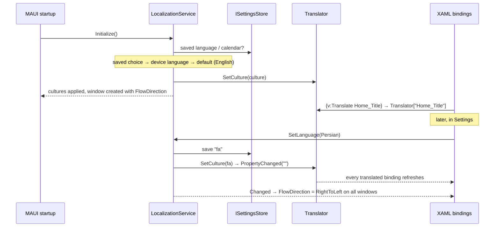

# Localization, right-to-left and calendars

Every app supports several languages from the first version. The user picks the language and the calendar in the
app's settings; the UI updates immediately, without restarting.

## Supported languages

| Language | Culture | Direction | Default calendar |
|---|---|---|---|
| English | `en` | Left-to-right | Gregorian |
| Persian (فارسی) | `fa` | **Right-to-left** | Persian (Solar Hijri) |
| German (Deutsch) | `de` | Left-to-right | Gregorian |

English is the neutral language: `AppResources.resx` holds English and is the fallback for anything not translated.
The list lives in `AppLanguages` (Vafadar.Localization); an app can offer a subset via `LocalizationOptions`.

## How it works

* **`LocalizationService`** owns the current language and calendar, persists them and applies them to
  `CultureInfo.CurrentCulture/CurrentUICulture` (and the defaults for new threads).
* **`Translator`** looks up strings: the app's resources first, then the shared strings of Vafadar.Localization
  (`Common_*`, `Settings_*`, `Backup_*`, …). A missing key shows the key itself, which makes gaps obvious.
* **`{v:Translate Key}`** (Vafadar.Maui) binds a XAML property to `Translator[Key]`; changing the language refreshes
  every such binding.
* **Flow direction** is applied to the window's root page at startup and whenever the language changes. Child
  elements inherit it.

## Working with strings

1. Add the key to the app's `Resources/Strings/AppResources.resx` (English) **and** to every translation
   (`AppResources.fa.resx`, `AppResources.de.resx`). Visual Studio's resource editor shows all languages side by side.
2. Key naming: `Area_Name` in PascalCase, e.g. `Home_Title`, `Transactions_AddButton`, `Errors_NetworkUnavailable`.
3. In XAML: `Text="{v:Translate Home_Title}"` (with `xmlns:v="http://vafadar.pro/schemas/maui"`).
4. In code: inject `Translator` and use `translator["Key"]` or `translator.Format("Key", arg0, ...)`.
5. Placeholders use `string.Format` syntax (`{0}`); add a `<comment>` in the neutral file explaining each placeholder.
6. Strings needed by more than one app belong in `src/Libraries/Vafadar.Localization/Resources/SharedStrings*.resx`.
   An app can override a shared string by defining the same key.

The test `ResourceCompletenessTests` checks **every** `.resx` under `src/`: each translation must have exactly the
neutral file's keys and the same placeholders. A forgotten translation fails the build pipeline.

## Right-to-left layout rules

* Layouts (`Grid`, `StackLayout`, `FlexLayout`, Shell, Syncfusion controls) mirror automatically when
  `FlowDirection` is `RightToLeft`. Design screens so that mirroring is correct: "start" and "end", not "left" and
  "right".
* Prefer symmetric `Margin` / `Padding`; review asymmetric values in both directions.
* Icons that imply direction (back arrows, "next" chevrons) must be mirrored; neutral icons (search, settings) must not.
* Numbers, amounts, dates, e-mail addresses and code-like text stay left-to-right inside RTL text. Test mixed
  Persian/Latin strings (e.g. an amount with a currency code) on a device.
* Test every screen in Persian on Android before a release.

## Dates and calendars

* **Storage is always Gregorian and culture-invariant**: `DateOnly` for calendar dates (e.g. a transaction date),
  `DateTimeOffset` (UTC) for moments (e.g. `CreatedAt`). Never store a formatted date.
* **Display** goes through `IDateFormatter`, which uses the selected calendar independently of the language:

  | Language | Calendar | `Short` | `Long` |
  |---|---|---|---|
  | English | Gregorian | `9/25/2026` | `Friday, September 25, 2026` |
  | English | Persian | `1405/07/03` | `Friday, 3 Mehr 1405` |
  | Persian | Persian | `1405/07/03` | `جمعه 3 مهر 1405` |
  | Persian | Gregorian | `2026/09/25` | `جمعه 25 سپتامبر 2026` |
  | German | Gregorian | `25.09.2026` | `Freitag, 25. September 2026` |

* Until the user explicitly picks a calendar, it follows the language (Persian → Persian calendar). An explicit
  choice is kept when the language changes.
* **Date input**: Syncfusion date pickers must be configured for the Persian calendar where supported; verify the
  control's Persian calendar support when building the first date-entry screen, and fall back to a custom picker if
  needed. This is tracked in the [roadmap](../roadmap.md).

## Numbers and currency

* Parse user input with `CultureInfo.CurrentCulture`, persist with `CultureInfo.InvariantCulture`. The Persian
  culture uses `٫` as the decimal separator; input fields must accept both `٫` and `.`, and both Persian (`۱۲۳`) and
  Latin (`123`) digits.
* Currency is **data, not culture**: an account or amount has an explicit currency code (EUR, IRR, …). Never use
  `ToString("C")` with the UI culture to decide the currency.
* Digits are shown as Latin digits by default. Showing Persian digits (۰–۹) in Persian is a planned option.

## Fonts

The template font (Open Sans) has no Persian glyphs; the operating system falls back to its own Persian font. Before
the first release, add a Persian font with an open license (e.g. [Vazirmatn](https://github.com/rastikerdar/vazirmatn),
SIL Open Font License) and use it for Persian text.

## Platform notes

* Android: `android:supportsRtl="true"` is set in `AndroidManifest.xml` (required for RTL).
* iOS: the supported languages are declared in `Info.plist` (`CFBundleLocalizations`), so system UI (e.g. permission
  dialogs) uses the right language.
* Android 13+ per-app language settings (system settings → app → language) are not wired yet. If added later, the
  system choice must be synchronized with the saved in-app choice.

## Adding a language

1. Add it to `AppLanguages` (Vafadar.Localization) and to `AppLanguages.All`.
2. Add `*.{culture}.resx` next to every neutral `.resx` in `src/` (the completeness test lists what is missing).
3. Add the culture to `SatelliteResourceLanguages` in `Directory.Build.props` and to `CFBundleLocalizations` in each
   iOS `Info.plist`.
4. Add store listing texts for the language.
