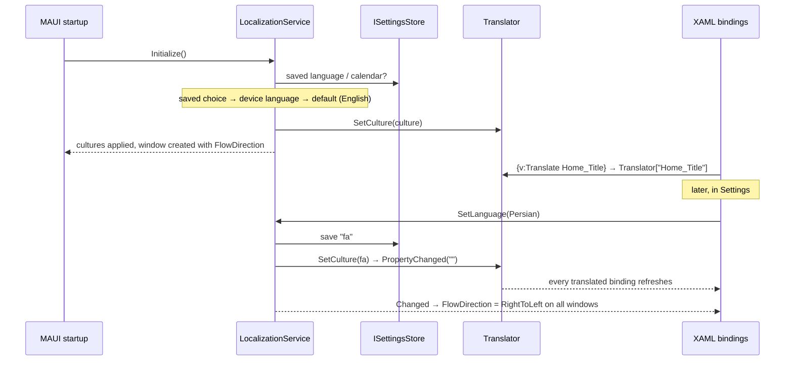

# Localization, right-to-left and calendars

Every app supports several languages from the first version. The user picks the language and the calendar in the
app's settings; the UI updates immediately, without restarting.

## Supported languages

| Language | Culture | Direction | Default calendar |
|---|---|---|---|
| English | `en` | Left-to-right | Gregorian |
| Persian (فارسی) | `fa` | **Right-to-left** | Persian (Solar Hijri) |
| German (Deutsch) | `de` | Left-to-right | Gregorian |
| Spanish (Español) | `es` | Left-to-right | Gregorian |
| French (Français) | `fr` | Left-to-right | Gregorian |
| Italian (Italiano) | `it` | Left-to-right | Gregorian |

English is the neutral language: `AppResources.resx` holds English and is the fallback for anything not translated.
The list lives in `AppLanguages` (Vafadar.Localization); an app can offer a subset via `LocalizationOptions`.
A device language is matched by its two-letter code, so `es-ES`, `es-MX`, `es-AR` and every other Spanish region get
the one general Spanish translation (`tú`). The language does not set the country, the currencies or the calendar;
numbers and dates follow the neutral `es` culture of the platform, not the conventions of each Spanish-speaking
country. French works the same way: one translation with `vous` for `fr-FR`, `fr-CA`, `fr-BE`, `fr-CH` …, no
country, currency (not EUR) or calendar taken from the language, and the neutral `fr` formats. Italian likewise:
one translation with `tu` for `it-IT`, `it-CH` …; it does not bring Swiss number formats, CHF or holidays.

## How it works

```mermaid
sequenceDiagram
    participant Startup as MAUI startup
    participant Loc as LocalizationService
    participant Settings as ISettingsStore
    participant T as Translator
    participant UI as XAML bindings

    Startup->>Loc: Initialize()
    Loc->>Settings: saved language / calendar?
    Note over Loc: saved choice → device language → default (English)
    Loc->>T: SetCulture(culture)
    Loc-->>Startup: cultures applied, window created with FlowDirection
    UI->>T: {v:Translate Home_Title} → Translator["Home_Title"]
    Note over UI: later, in Settings
    UI->>Loc: SetLanguage(Persian)
    Loc->>Settings: save "fa"
    Loc->>T: SetCulture(fa) → PropertyChanged("")
    T-->>UI: every translated binding refreshes
    Loc-->>UI: Changed → FlowDirection = RightToLeft on all windows
```

* **`LocalizationService`** owns the current language and calendar, persists them and applies them to
  `CultureInfo.CurrentCulture/CurrentUICulture` (and the defaults for new threads).
* **`Translator`** looks up strings: the app's resources first, then the shared strings of Vafadar.Localization
  (`Common_*`, `Settings_*`, `Backup_*`, …). A missing key shows the key itself, which makes gaps obvious.
* **`{v:Translate Key}`** (Vafadar.Maui) binds a XAML property to `Translator[Key]`; changing the language refreshes
  every such binding.
* **Flow direction** is applied to the window's root page at startup and whenever the language changes. Child
  elements inherit it.

## Working with strings

1. Add the key to the app's `Resources/Strings/AppResources.resx` (English) **and** to every translation
   (`AppResources.fa.resx`, `AppResources.de.resx`). Visual Studio's resource editor shows all languages side by side.
2. Key naming: `Area_Name` in PascalCase, e.g. `Home_Title`, `Transactions_AddButton`, `Errors_NetworkUnavailable`.
3. In XAML: `Text="{v:Translate Home_Title}"` (with `xmlns:v="http://vafadar.pro/schemas/maui"`).
4. In code: inject `Translator` and use `translator["Key"]` or `translator.Format("Key", arg0, ...)`.
5. Placeholders use `string.Format` syntax (`{0}`); add a `<comment>` in the neutral file explaining each placeholder.
6. Strings needed by more than one app belong in `src/Libraries/Vafadar.Localization/Resources/SharedStrings*.resx`.
   An app can override a shared string by defining the same key.

The test `ResourceCompletenessTests` checks **every** `.resx` under `src/`: each translation must have exactly the
neutral file's keys and the same placeholders. A forgotten translation fails the build pipeline.

## Right-to-left layout rules

* Layouts (`Grid`, `StackLayout`, `FlexLayout`, Shell, Syncfusion controls) mirror automatically when
  `FlowDirection` is `RightToLeft`. Design screens so that mirroring is correct: "start" and "end", not "left" and
  "right".
* Prefer symmetric `Margin` / `Padding`; review asymmetric values in both directions.
* Icons that imply direction (back arrows, "next" chevrons) must be mirrored; neutral icons (search, settings) must not.
* Numbers, amounts, dates, e-mail addresses and code-like text stay left-to-right inside RTL text. Test mixed
  Persian/Latin strings (e.g. an amount with a currency code) on a device.
* Test every screen in Persian on Android before a release.

## Dates and calendars

* **Storage is always Gregorian and culture-invariant**: `DateOnly` for calendar dates (e.g. a transaction date),
  `DateTimeOffset` (UTC) for moments (e.g. `CreatedAt`). Never store a formatted date.
* **Display** goes through `IDateFormatter`, which uses the selected calendar independently of the language:

  | Language | Calendar | `Short` | `Long` |
  |---|---|---|---|
  | English | Gregorian | `9/25/2026` | `Friday, September 25, 2026` |
  | English | Persian | `1405/07/03` | `Friday, 3 Mehr 1405` |
  | Persian | Persian | `1405/07/03` | `جمعه 3 مهر 1405` |
  | Persian | Gregorian | `2026/09/25` | `جمعه 25 سپتامبر 2026` |
  | German | Gregorian | `25.09.2026` | `Freitag, 25. September 2026` |
  | English | Hijri | `1448/04/14` | `Friday, 14 Rabi al-Thani 1448` |
  | Persian | Hijri | `1448/04/14` | `جمعه 14 ربیع‌الثانی 1448` |
  | German | Hijri | `1448/04/14` | `Freitag, 14 Rabi al-Thani 1448` |
  | Spanish | Gregorian | `25/09/2026` | `viernes, 25 de septiembre de 2026` |
  | Spanish | Persian | `1405/07/03` | `viernes, 3 de Mehr de 1405` |
  | Spanish | Hijri | `1448/04/14` | `viernes, 14 de Rabi al-Thani de 1448` |
  | French | Gregorian | `25/09/2026` | `vendredi 25 septembre 2026` |
  | French | Persian | `1405/07/03` | `vendredi 3 Mehr 1405` |
  | Italian | Gregorian | `25/09/2026` | `venerdì 25 settembre 2026` |
  | Italian | Persian | `1405/07/03` | `venerdì 3 Mehr 1405` |

  `MonthYear` (`Rabi al-Thani 1448`), `DayMonth` (`14 Rabi al-Thani`), `DayMonthShort` (`14 Rab II`, `Sep 25`, for
  date tiles and chart axes) and `Month` (`Rabi al-Thani`) follow the same rules. `Format(date, style, calendar)`
  writes a date in another calendar than the display one without changing the user's choice, e.g. the day of a
  Gregorian plan while the dates are shown in the Persian calendar. The short names stay distinct: cutting names to three letters would
  show "Rab" for both Rabi months. The words between day, month and year come from the culture's own patterns
  (Spanish `d 'de' MMMM`, `MMMM 'de' yyyy`), also for converted calendars ("3 de Mehr", "Mehr de 1405"); the short
  form for date tiles drops such quoted words ("25 sep"), so a tile never shows "de" as part of the month. The
  separator after the weekday also comes from the culture's long pattern: ", " in English, German and Spanish, a
  space in French, Italian ("venerdì 3 Mehr 1405") and Persian.
* **Weekday grammar**: phrases such as "the first Sunday" agree with the weekday's gender. Italian "domenica" is
  feminine ("la prima domenica", "l’ultima domenica"), the other weekdays masculine ("il primo lunedì").
  `WeekdayGrammar` picks the `_Feminine` keys (`Ordinal_Feminine_{n}`, `Rule_NthWeekday_Feminine`,
  `Rule_LastWeekday_Feminine`, `DayRule_LastWeekday_Feminine`) from the culture and the `DayOfWeek` value, never from
  the spelling of the name. The other languages hold the same texts in these keys as in the plain ones, only for key
  parity; a new language with gendered weekdays extends `WeekdayGrammar.IsFeminine`.
* **Three calendars** (`CalendarSystem`): Gregorian, Persian (solar Hijri) and lunar Hijri. The lunar calendar is
  **Umm al-Qura** (the official calendar of Saudi Arabia, e.g. 1 Ramadan 1446 = 1 March 2025), which .NET covers for
  1318–1500 AH (30 April 1900 to 16 November 2077). `Vafadar.Core.Dates.LunarHijri` is the one place that converts
  lunar dates: inside that range it uses `UmAlQuraCalendar`, outside it the arithmetic (tabular) `HijriCalendar`, so a
  date never fails to show. Months observed locally by moon sighting can differ by a day; that is accepted.
* When the culture has the calendar itself (Persian with the Persian calendar, an Arabic culture with Umm al-Qura),
  the culture formats the date; otherwise `DateFormatter` converts it and uses its own month names (Latin
  transliteration in English and German, Persian spelling in Persian).
* Until the user explicitly picks a calendar, it follows the language (Persian → Persian calendar). An explicit
  choice is kept when the language changes.
* **Periods and plans** use the same calendars (`PeriodCalendar` in Zanance: budget months, monthly and yearly plans,
  the dates of a CSV import, receipts). A lunar month has 29 or 30 days; a plan on day 30 falls on the 29th in a
  29-day month (missing-day rule). The app translates between the two enums only in `Presentation.Calendars`; a
  screen never compares with a single calendar itself. A plan in another calendar than the display names its
  calendar ("Every month on day 2 · Gregorian").
* **Date input**: `DateField` (Vafadar.Maui) has three number boxes – day, month, year – in the display calendar,
  with the full date written below. `CalendarDates` (Vafadar.Localization) converts the parts in every calendar,
  knows the month lengths (a lunar month has 29 or 30 days) and the order of the boxes: Gregorian dates follow the
  culture (`M/d/yyyy` in English, `d.M.yyyy` in German), Persian and lunar Hijri dates are entered year/month/day,
  and in Persian the boxes are laid out from the right so that they read `1405 / 07 / 03` (D-59). Dates from
  1900 to 2199 can be entered.

## Numbers and currency

* Parse user input with `CultureInfo.CurrentCulture`, persist with `CultureInfo.InvariantCulture`. The Persian
  culture uses `٫` as the decimal separator; input fields must accept both `٫` and `.`, and both Persian (`۱۲۳`) and
  Latin (`123`) digits.
* Currency is **data, not culture**: an account or amount has an explicit currency code (EUR, IRR, …). Never use
  `ToString("C")` with the UI culture to decide the currency.
* Digits are shown as Latin digits by default. In Persian the user can choose Persian digits (۰–۹): `NativeDigits`
  changes only the displayed text; formatting and storage keep Latin digits.

## Fonts

Persian text uses [Vazirmatn](https://github.com/rastikerdar/vazirmatn) (SIL Open Font License), which also covers
Latin and Arabic; English, German and Spanish use Figtree with Urbanist for titles (`App.xaml.cs`). The PDF report
embeds Vazirmatn for every language. All bundled fonts contain the Spanish, French and Italian letters (ñ, ü, á–ú,
¿, ¡, ç, œ, à, è, é, ì, ò, ù, ’, « »). Figtree and Urbanist have no narrow no-break space (U+202F), which French uses before "?", "!" and
";" and as the thousands separator of amounts; the platforms take it from a system font (checked in the Windows
snapshots), the PDF's Vazirmatn has it.

## Platform notes

* Android: `android:supportsRtl="true"` is set in `AndroidManifest.xml` (required for RTL).
* iOS: the supported languages are declared in `Info.plist` (`CFBundleLocalizations`), so system UI (e.g. permission
  dialogs) uses the right language.
* Android 13+ per-app language (system settings → app → language): the languages are declared in
  `Resources/xml/locales_config.xml` and kept in step with the in-app choice by `AppLocales` (D-32).
* The Android widget and the iOS permission prompts have their own files per language (`values-{culture}/widget.xml`,
  `{culture}.lproj/InfoPlist.strings`).

## Adding a language

1. Add it to `AppLanguages` (Vafadar.Localization) and to `AppLanguages.All`.
2. Add `*.{culture}.resx` next to every neutral `.resx` in `src/` (the completeness test lists what is missing).
3. Add the culture to `SatelliteResourceLanguages` in `Directory.Build.props`, to `CFBundleLocalizations` in each
   iOS `Info.plist` and to the Android `locales_config.xml`; add the widget and permission texts of the platforms.
4. Add the language to `eng/scripts/Add-Strings.ps1`, so every new string asks for it.
5. Add store listing texts for the language.
6. If the language inflects words by the weekday's gender, extend `WeekdayGrammar` (see "Weekday grammar").
7. Set its default calendar in `LocalizationOptions` (e.g. Arabic → `CalendarSystem.Hijri`) and check the date table
   above in that language.

### Before adding Arabic

The three calendars, right-to-left layout, input of Arabic-Indic digits (٠–٩, `Digits.ToAscii`) and the Arabic forms
of ي and ك in search and rules are ready. Still to do:

* **Font**: the app font is chosen for Persian only (`App.xaml.cs`: Vazirmatn for Persian, Figtree otherwise). Vazirmatn
  covers Arabic as well; the choice must follow the script (or right-to-left), not the language "fa".
* **Digits**: the native-digits option (`NativeDigits`) writes Persian digits (۰–۹); Arabic needs Arabic-Indic digits
  (٠–٩), so the option needs the digit set of the language.
* **Culture calendar**: `ar-SA` has Umm al-Qura among its calendars (`CultureFactory` selects it), so month names come
  from the culture; check the chosen Arabic culture offers it, otherwise the Latin names are used.
* **Translations** of every `.resx` (the completeness test lists the missing ones) and of the store listing.
