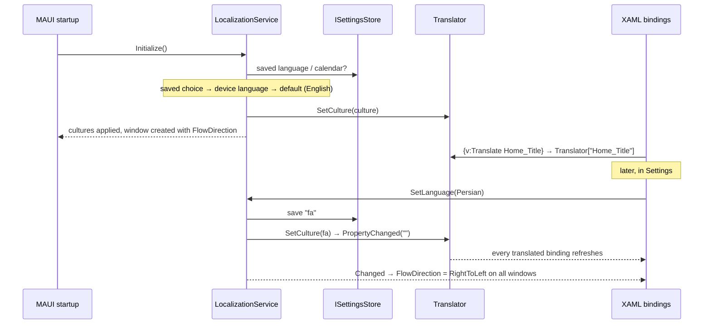

# Localization, right-to-left and calendars

Every app supports several languages from the first version. The user picks the language and the calendar in the
app's settings; the UI updates immediately, without restarting.

## Supported languages

| Language | Culture | Direction | Default calendar |
|---|---|---|---|
| English | `en` | Left-to-right | Gregorian |
| Persian (فارسی) | `fa` | **Right-to-left** | Persian (Solar Hijri) |
| German (Deutsch) | `de` | Left-to-right | Gregorian |

English is the neutral language: `AppResources.resx` holds English and is the fallback for anything not translated.
The list lives in `AppLanguages` (Vafadar.Localization); an app can offer a subset via `LocalizationOptions`.

## How it works

```mermaid
sequenceDiagram
    participant Startup as MAUI startup
    participant Loc as LocalizationService
    participant Settings as ISettingsStore
    participant T as Translator
    participant UI as XAML bindings

    Startup->>Loc: Initialize()
    Loc->>Settings: saved language / calendar?
    Note over Loc: saved choice → device language → default (English)
    Loc->>T: SetCulture(culture)
    Loc-->>Startup: cultures applied, window created with FlowDirection
    UI->>T: {v:Translate Home_Title} → Translator["Home_Title"]
    Note over UI: later, in Settings
    UI->>Loc: SetLanguage(Persian)
    Loc->>Settings: save "fa"
    Loc->>T: SetCulture(fa) → PropertyChanged("")
    T-->>UI: every translated binding refreshes
    Loc-->>UI: Changed → FlowDirection = RightToLeft on all windows
```

* **`LocalizationService`** owns the current language and calendar, persists them and applies them to
  `CultureInfo.CurrentCulture/CurrentUICulture` (and the defaults for new threads).
* **`Translator`** looks up strings: the app's resources first, then the shared strings of Vafadar.Localization
  (`Common_*`, `Settings_*`, `Backup_*`, …). A missing key shows the key itself, which makes gaps obvious.
* **`{v:Translate Key}`** (Vafadar.Maui) binds a XAML property to `Translator[Key]`; changing the language refreshes
  every such binding.
* **Flow direction** is applied to the window's root page at startup and whenever the language changes. Child
  elements inherit it.

## Working with strings

1. Add the key to the app's `Resources/Strings/AppResources.resx` (English) **and** to every translation
   (`AppResources.fa.resx`, `AppResources.de.resx`). Visual Studio's resource editor shows all languages side by side.
2. Key naming: `Area_Name` in PascalCase, e.g. `Home_Title`, `Transactions_AddButton`, `Errors_NetworkUnavailable`.
3. In XAML: `Text="{v:Translate Home_Title}"` (with `xmlns:v="http://vafadar.pro/schemas/maui"`).
4. In code: inject `Translator` and use `translator["Key"]` or `translator.Format("Key", arg0, ...)`.
5. Placeholders use `string.Format` syntax (`{0}`); add a `<comment>` in the neutral file explaining each placeholder.
6. Strings needed by more than one app belong in `src/Libraries/Vafadar.Localization/Resources/SharedStrings*.resx`.
   An app can override a shared string by defining the same key.

The test `ResourceCompletenessTests` checks **every** `.resx` under `src/`: each translation must have exactly the
neutral file's keys and the same placeholders. A forgotten translation fails the build pipeline.

## Right-to-left layout rules

* Layouts (`Grid`, `StackLayout`, `FlexLayout`, Shell, Syncfusion controls) mirror automatically when
  `FlowDirection` is `RightToLeft`. Design screens so that mirroring is correct: "start" and "end", not "left" and
  "right".
* Prefer symmetric `Margin` / `Padding`; review asymmetric values in both directions.
* Icons that imply direction (back arrows, "next" chevrons) must be mirrored; neutral icons (search, settings) must not.
* Numbers, amounts, dates, e-mail addresses and code-like text stay left-to-right inside RTL text. Test mixed
  Persian/Latin strings (e.g. an amount with a currency code) on a device.
* Test every screen in Persian on Android before a release.

## Dates and calendars

* **Storage is always Gregorian and culture-invariant**: `DateOnly` for calendar dates (e.g. a transaction date),
  `DateTimeOffset` (UTC) for moments (e.g. `CreatedAt`). Never store a formatted date.
* **Display** goes through `IDateFormatter`, which uses the selected calendar independently of the language:

  | Language | Calendar | `Short` | `Long` |
  |---|---|---|---|
  | English | Gregorian | `9/25/2026` | `Friday, September 25, 2026` |
  | English | Persian | `1405/07/03` | `Friday, 3 Mehr 1405` |
  | Persian | Persian | `1405/07/03` | `جمعه 3 مهر 1405` |
  | Persian | Gregorian | `2026/09/25` | `جمعه 25 سپتامبر 2026` |
  | German | Gregorian | `25.09.2026` | `Freitag, 25. September 2026` |
  | English | Hijri | `1448/04/14` | `Friday, 14 Rabi al-Thani 1448` |
  | Persian | Hijri | `1448/04/14` | `جمعه 14 ربیع‌الثانی 1448` |
  | German | Hijri | `1448/04/14` | `Freitag, 14 Rabi al-Thani 1448` |

  `MonthYear` (`Rabi al-Thani 1448`), `DayMonth` (`14 Rabi al-Thani`), `DayMonthShort` (`14 Rab II`, `Sep 25`, for
  date tiles and chart axes) and `Month` (`Rabi al-Thani`) follow the same rules. `Format(date, style, calendar)`
  writes a date in another calendar than the display one without changing the user's choice, e.g. the day of a
  Gregorian plan while the dates are shown in the Persian calendar. The short names stay distinct: cutting names to three letters would
  show "Rab" for both Rabi months.
* **Three calendars** (`CalendarSystem`): Gregorian, Persian (solar Hijri) and lunar Hijri. The lunar calendar is
  **Umm al-Qura** (the official calendar of Saudi Arabia, e.g. 1 Ramadan 1446 = 1 March 2025), which .NET covers for
  1318–1500 AH (30 April 1900 to 16 November 2077). `Vafadar.Core.Dates.LunarHijri` is the one place that converts
  lunar dates: inside that range it uses `UmAlQuraCalendar`, outside it the arithmetic (tabular) `HijriCalendar`, so a
  date never fails to show. Months observed locally by moon sighting can differ by a day; that is accepted.
* When the culture has the calendar itself (Persian with the Persian calendar, an Arabic culture with Umm al-Qura),
  the culture formats the date; otherwise `DateFormatter` converts it and uses its own month names (Latin
  transliteration in English and German, Persian spelling in Persian).
* Until the user explicitly picks a calendar, it follows the language (Persian → Persian calendar). An explicit
  choice is kept when the language changes.
* **Periods and plans** use the same calendars (`PeriodCalendar` in Zanance: budget months, monthly and yearly plans,
  the dates of a CSV import, receipts). A lunar month has 29 or 30 days; a plan on day 30 falls on the 29th in a
  29-day month (missing-day rule). The app translates between the two enums only in `Presentation.Calendars`; a
  screen never compares with a single calendar itself. A plan in another calendar than the display names its
  calendar ("Every month on day 2 · Gregorian").
* **Date input**: `DateField` (Vafadar.Maui) opens the Syncfusion calendar dialog in the display calendar
  (`CalendarIdentifier.Persian` or `UmAlQura`; a date outside the Umm al-Qura range opens in the Gregorian dialog).

## Numbers and currency

* Parse user input with `CultureInfo.CurrentCulture`, persist with `CultureInfo.InvariantCulture`. The Persian
  culture uses `٫` as the decimal separator; input fields must accept both `٫` and `.`, and both Persian (`۱۲۳`) and
  Latin (`123`) digits.
* Currency is **data, not culture**: an account or amount has an explicit currency code (EUR, IRR, …). Never use
  `ToString("C")` with the UI culture to decide the currency.
* Digits are shown as Latin digits by default. In Persian the user can choose Persian digits (۰–۹): `NativeDigits`
  changes only the displayed text; formatting and storage keep Latin digits.

## Fonts

Persian text uses [Vazirmatn](https://github.com/rastikerdar/vazirmatn) (SIL Open Font License), which also covers
Latin and Arabic; English and German use Figtree with Urbanist for titles (`App.xaml.cs`). The PDF report embeds
Vazirmatn for every language.

## Platform notes

* Android: `android:supportsRtl="true"` is set in `AndroidManifest.xml` (required for RTL).
* iOS: the supported languages are declared in `Info.plist` (`CFBundleLocalizations`), so system UI (e.g. permission
  dialogs) uses the right language.
* Android 13+ per-app language settings (system settings → app → language) are not wired yet. If added later, the
  system choice must be synchronized with the saved in-app choice.

## Adding a language

1. Add it to `AppLanguages` (Vafadar.Localization) and to `AppLanguages.All`.
2. Add `*.{culture}.resx` next to every neutral `.resx` in `src/` (the completeness test lists what is missing).
3. Add the culture to `SatelliteResourceLanguages` in `Directory.Build.props` and to `CFBundleLocalizations` in each
   iOS `Info.plist`.
4. Add store listing texts for the language.
5. Set its default calendar in `LocalizationOptions` (e.g. Arabic → `CalendarSystem.Hijri`) and check the date table
   above in that language.

### Before adding Arabic

The three calendars, right-to-left layout, input of Arabic-Indic digits (٠–٩, `Digits.ToAscii`) and the Arabic forms
of ي and ك in search and rules are ready. Still to do:

* **Font**: the app font is chosen for Persian only (`App.xaml.cs`: Vazirmatn for Persian, Figtree otherwise). Vazirmatn
  covers Arabic as well; the choice must follow the script (or right-to-left), not the language "fa".
* **Digits**: the native-digits option (`NativeDigits`) writes Persian digits (۰–۹); Arabic needs Arabic-Indic digits
  (٠–٩), so the option needs the digit set of the language.
* **Culture calendar**: `ar-SA` has Umm al-Qura among its calendars (`CultureFactory` selects it), so month names come
  from the culture; check the chosen Arabic culture offers it, otherwise the Latin names are used.
* **Translations** of every `.resx` (the completeness test lists the missing ones) and of the store listing.
