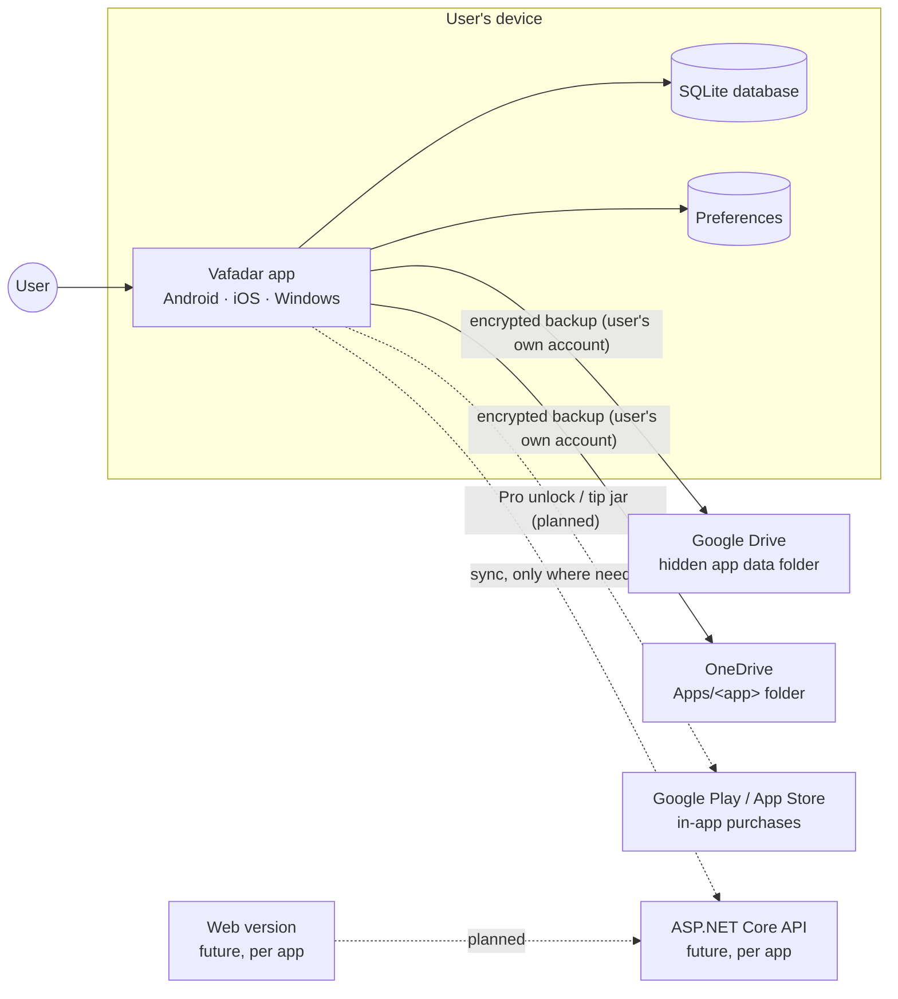
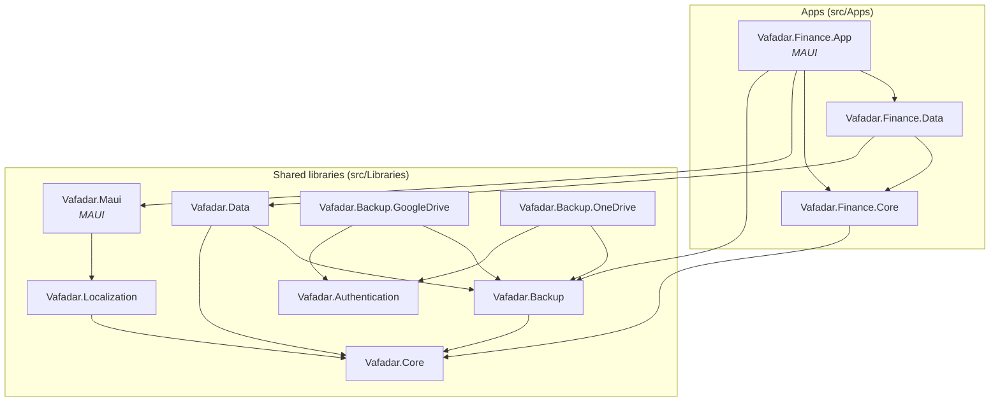

# Architecture overview

This document describes the overall design of the Vafadar Apps repository: what it contains, how the parts fit
together and the rules that keep it maintainable as more apps are added. Detailed topics have their own documents
(linked below), and the reasoning behind each major decision is recorded in the [ADRs](../adr/README.md).

## Goals and constraints

| Goal / constraint | Consequence for the design |
|---|---|
| Many small apps, mostly independent, sometimes a web and mobile version of the same idea | One repository with shared libraries; each app is a self-contained folder ([ADR 0001](../adr/0001-monorepo-with-shared-libraries.md)) |
| Mostly mobile apps, Microsoft stack | .NET 10 LTS + .NET MAUI; Blazor for web ([ADR 0002](../adr/0002-dotnet-10-and-central-build-configuration.md), [ADR 0003](../adr/0003-ui-technology.md)) |
| Personal use first, but published to Google Play / App Store | Store-grade quality: signing, privacy policy, privacy matrix, localization, tests, CI |
| Multilingual from day one (English, Persian, German) | Runtime language switching, right-to-left layout, calendar chosen independently of language ([ADR 0007](../adr/0007-localization.md)) |
| Data must never be lost | Local-first SQLite database + encrypted backups to the user's own Google Drive / OneDrive ([ADR 0005](../adr/0005-local-first-data.md), [ADR 0006](../adr/0006-backup-to-user-cloud-storage.md)) |
| No server needed for most apps | Apps work fully offline; backup storage belongs to the user; a backend is added only per app when needed |
| Public source code, not open source | "All rights reserved" license; secrets injected at build time, never committed ([ADR 0009](../adr/0009-secrets-and-source-available-license.md)) |
| Syncfusion Essential Studio license available | Syncfusion MAUI / Blazor controls for rich UI (charts, grids, pickers); license key handled as a build secret |

## System context



The developer operates **no server** for the default app type: all data lives on the device, and backups go to cloud
storage owned by the user. This keeps costs at zero and makes the privacy story simple (see [privacy](../privacy/README.md)).

## Building blocks

The repository has two kinds of code:

1. **Shared libraries** (`src/Libraries/Vafadar.*`) – reusable infrastructure that knows nothing about any
   particular app.
2. **Apps** (`src/Apps/<App>/Vafadar.<App>.*`) – one folder per product, containing its domain, data and UI projects
   (and later its web/API projects).

### Shared libraries

| Library | Purpose | Depends on | Status |
|---|---|---|---|
| [Vafadar.Core](../../src/Libraries/Vafadar.Core/README.md) | Entity base (GUID v7 ids), audit interface, app environment and settings abstractions | – | ✅ |
| [Vafadar.Localization](../../src/Libraries/Vafadar.Localization/README.md) | Languages, runtime language switching, RTL, Gregorian/Persian calendar, shared UI strings | Core | ✅ |
| [Vafadar.Data](../../src/Libraries/Vafadar.Data/README.md) | EF Core SQLite base context and conventions, audit timestamps, database backup source | Core, Backup | ✅ |
| [Vafadar.Backup](../../src/Libraries/Vafadar.Backup/README.md) | Backup package format, AES-GCM encryption, retention, restore validation, local folder storage | Core | ✅ |
| [Vafadar.Backup.GoogleDrive](../../src/Libraries/Vafadar.Backup.GoogleDrive/README.md) | Backup storage in the user's Google Drive app data folder | Backup, Authentication | ✅ (needs sign-in implementation) |
| [Vafadar.Backup.OneDrive](../../src/Libraries/Vafadar.Backup.OneDrive/README.md) | Backup storage in the user's OneDrive app folder | Backup, Authentication | ✅ (needs sign-in implementation) |
| [Vafadar.Authentication](../../src/Libraries/Vafadar.Authentication/README.md) | Sign-in and access-token abstractions for Google / Microsoft accounts | – | ✅ abstractions |
| [Vafadar.Maui](../../src/Libraries/Vafadar.Maui/README.md) | MAUI bootstrap (`UseVafadar`), preferences, `{v:Translate}`, RTL, date field and chips, device authentication for app locks, Syncfusion setup, MVVM base | Core, Localization | ✅ |
| Vafadar.Authentication.Maui | Google and Microsoft sign-in on Android / iOS / Windows (MSAL, Google OAuth) | Authentication | 🔜 planned |
| Vafadar.Maui.Backup | Backup settings page, automatic backup scheduling, restore flow UI | Maui, Backup | 🔜 planned (Finance has its own backup screen; extract when a second app needs it) |
| Vafadar.Monetization | "Pro" unlock and tip jar via Google Play Billing / StoreKit | – | 🔜 planned ([details](monetization.md)) |
| Vafadar.Web | Shared Blazor components, layout, localization for web apps | Localization | 🔜 when the first web app starts |

A library is created when a second app needs the same thing, or when the concern is clearly generic from the start
(backup, localization, authentication). App-specific code stays in the app until it is needed elsewhere.

### Apps

| App | Folder | Platforms | Status |
|---|---|---|---|
| Zanance (project Finance) – personal finance manager | [`src/Apps/Finance`](../../src/Apps/Finance/README.md) | Android, iOS, Windows | 🚧 phase 1 feature-complete except cloud backup; device tests and store release pending |

Every app uses the same project structure ([ADR 0004](../adr/0004-project-structure-per-app.md)):

| Project | Kind | Contains | May reference |
|---|---|---|---|
| `Vafadar.<App>.Core` | `net10.0` class library | Domain model (entities, value objects), business rules, use cases, interfaces | `Vafadar.Core` only |
| `Vafadar.<App>.Data` | `net10.0` class library | `DbContext`, entity configurations, migrations, repositories/queries | `<App>.Core`, `Vafadar.Data` |
| `Vafadar.<App>.App` | .NET MAUI app | Pages, view models, platform code, composition root (`MauiProgram`) | everything above + `Vafadar.Maui`, backup, auth |
| `Vafadar.<App>.Web` *(when needed)* | Blazor Web App | Web UI | `<App>.Core`, `Vafadar.Web`, API client |
| `Vafadar.<App>.Api` *(when needed)* | ASP.NET Core | Server API and server database | `<App>.Core` |

Core and Data are plain .NET, so they are unit-testable without devices and reusable by a future web or API project.

### Dependency graph



### Dependency rules

1. **Apps never reference other apps.** Anything two apps share moves into a library.
2. **Libraries never reference apps.**
3. **Platform-independent code never references MAUI.** Only `Vafadar.Maui` (and future `*.Maui` libraries) and the
   `*.App` projects use MAUI. Everything else targets `net10.0` and runs in tests, on servers and in Blazor.
4. **`<App>.Core` has no infrastructure dependencies** – no EF Core, no HTTP, no MAUI.
5. **Composition happens in one place** per app: `MauiProgram.cs` (or `Program.cs` for web).
6. **Abstractions live with their consumer**, implementations in a separate project when they pull in heavy or
   platform-specific dependencies (e.g. `IAccessTokenProvider` in `Vafadar.Authentication`, MSAL in
   `Vafadar.Authentication.Maui`).

## Inside a MAUI app

```text
Vafadar.Finance.App/
├── MauiProgram.cs            Composition root: UseVafadar(), data, backup, pages, view models
├── App.xaml(.cs)             Application; creates the window with the right flow direction
├── AppShell.xaml             Navigation structure (tabs / flyout, routes)
├── Features/
│   ├── Home/                 HomePage.xaml + HomePage.xaml.cs + HomeViewModel.cs
│   └── Settings/             SettingsPage.xaml + SettingsViewModel.cs
├── Resources/
│   ├── Strings/              AppResources.resx (+ .fa.resx, .de.resx), AppStrings.cs
│   ├── Styles/               Colors.xaml, Styles.xaml
│   ├── AppIcon/ Splash/ Fonts/ Images/ Raw/
└── Platforms/                Android, iOS, Windows specifics
```

* **MVVM** with [CommunityToolkit.Mvvm](https://learn.microsoft.com/dotnet/communitytoolkit/mvvm/) source generators
  (`[ObservableProperty]` on partial properties, `[RelayCommand]`). View models derive from `ViewModelBase`.
* **Feature folders**: a page, its view model and feature-specific views live together.
* **Compiled bindings** everywhere (`x:DataType` on every page) and XAML source generation (`MauiXamlInflator=SourceGen`):
  faster, trimming-safe, and binding errors are compile-time errors.
* **Dependency injection** for pages and view models (constructor injection); Shell resolves pages from DI.
* **Syncfusion MAUI controls** for complex UI (charts, data grid, date pickers, …). Only `Syncfusion.Maui.Core` is
  referenced by default; apps add the control packages they use.
* **Startup sequence**: `UseVafadar()` registers the license and services → `IMauiInitializeService`s run while the
  app is built (saved language is applied, database is migrated) → `App.CreateWindow` creates the shell with the
  correct flow direction.

## Cross-cutting concerns

| Concern | Approach | Details |
|---|---|---|
| Localization & RTL | `.resx` per project, `Translator` + `{v:Translate Key}`, runtime switch, `IDateFormatter` for calendar-aware dates | [localization.md](localization.md) |
| Local data | SQLite + EF Core, `LocalDbContext` conventions, migrations applied at startup | [data-and-backup.md](data-and-backup.md) |
| Backup & restore | Package → optional encryption → user's cloud storage; retention; validated restore | [data-and-backup.md](data-and-backup.md) |
| Authentication | Per-provider sign-in services (keyed DI) providing access tokens; server auth later | [authentication.md](authentication.md) |
| Web + mobile | Shared Core, per-app API, optional sync | [web-and-shared-data.md](web-and-shared-data.md) |
| Monetization | Free / Free + Pro / tip jar through store billing | [monetization.md](monetization.md) |
| Settings | `ISettingsStore` (MAUI `Preferences`), keys namespaced by feature (`localization.language`) | `Vafadar.Core` |
| Time | Inject `TimeProvider`; never `DateTime.Now` in logic (testability, time zones) | [coding conventions](../guides/coding-conventions.md) |
| Secrets | Build-time injection (`eng/AppSecrets.targets`), GitHub secrets in CI | [secrets guide](../guides/secrets-and-configuration.md) |
| Privacy | Data minimization, local-first, per-app privacy matrix | [privacy](../privacy/README.md) |
| Quality | Warnings are errors in CI, analyzers + `.editorconfig`, unit tests per project | [building](../guides/building.md), [testing](../guides/testing.md) |

## Technology stack

| Area | Choice | Version (September 2026) |
|---|---|---|
| Runtime / SDK | .NET 10 (LTS) | SDK 10.0.401 (`global.json`, roll forward to latest feature band) |
| Language | C# 14, nullable enabled, implicit usings | – |
| Mobile / desktop UI | .NET MAUI (XAML) | 10.0.110 |
| MVVM | CommunityToolkit.Mvvm | 8.4.2 |
| UI controls | Syncfusion Essential Studio for MAUI (and Blazor for web) | 34.2.9 |
| Local database | SQLite via Microsoft.Data.Sqlite + EF Core | 10.0.12 |
| Serialization | System.Text.Json with source generation | in-box |
| Tests | xUnit v3 on Microsoft.Testing.Platform | 4.0.1 |
| CI | GitHub Actions (Linux: tests + Android; Windows; macOS: iOS on demand), CodeQL, Dependabot | – |
| Web (future) | ASP.NET Core, Blazor Web App, possibly .NET Aspire | .NET 10 |

Package versions are managed centrally in [`Directory.Packages.props`](../../Directory.Packages.props) and updated
by Dependabot.

## Platform support

| Platform | Minimum | Build machine | Notes |
|---|---|---|---|
| Android | 7.0 (API 24) | Windows, macOS, Linux | Primary development target |
| iOS | 15.0 | macOS (or Windows with paired Mac) | After the Android version of an app is complete |
| Windows | 10 1809 (build 17763) | Windows | Unpackaged `.exe` for development and personal use; Microsoft Store optional later |
| Web | Evergreen browsers | Any | Per app, when needed |

Mac Catalyst is deliberately not targeted; it can be added to `VafadarMauiTargetFrameworks` in
`Directory.Build.props` if ever needed.
